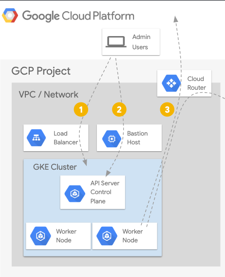

# Déploiement d’un cluster Kubernetes privé sur Google Cloud

## Schéma de la configuration à mettre en place



```bash
# Create VPC

gcloud compute networks create kubernetes --project=melodic-eye-388413 --subnet-mode=custom --mtu=1460 --bgp-routing-mode=regional

# Create Subnet

gcloud compute networks subnets create kubernetes-subnet --project=melodic-eye-388413 --range=10.0.0.0/9 --stack-type=IPV4_ONLY --network=kubernetes --region=europe-west1

# Create Cluster

gcloud container --project "melodic-eye-388413" clusters create-auto "cluster-kubernetes" --region "europe-west1" --release-channel "regular" --enable-private-nodes --enable-private-endpoint --master-ipv4-cidr "172.16.0.0/28" --enable-master-authorized-networks --network "projects/melodic-eye-388413/global/networks/kubernetes" --subnetwork "projects/melodic-eye-388413/regions/europe-west1/subnetworks/kubernetes-subnet" --cluster-ipv4-cidr "172.20.0.0/16" --services-ipv4-cidr "172.21.0.0/24"
```