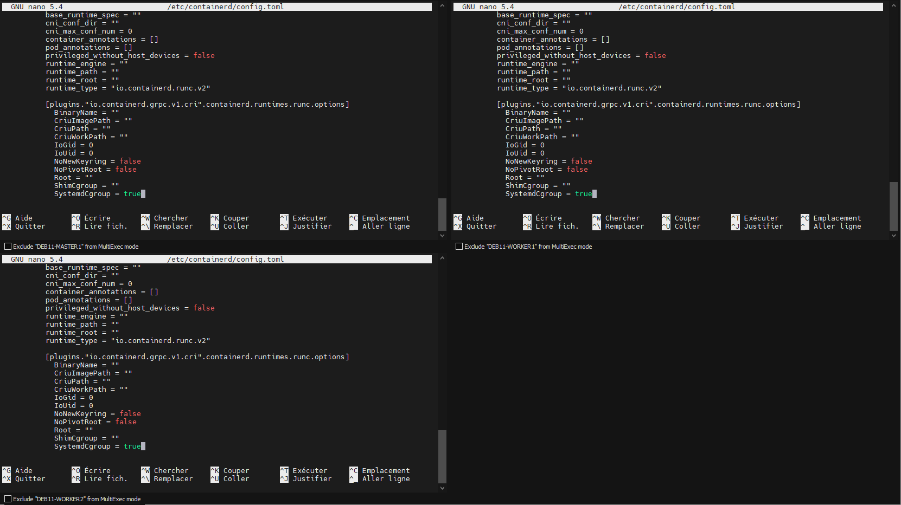
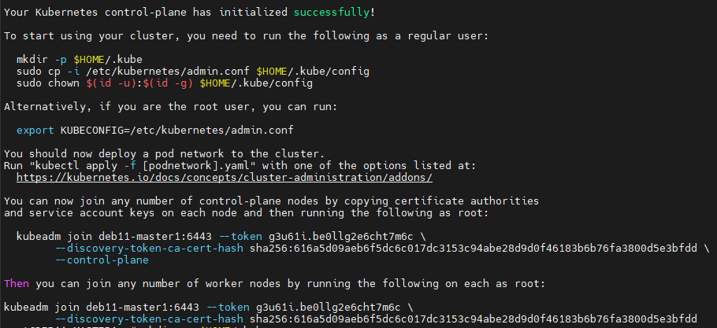
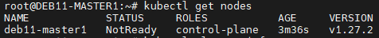
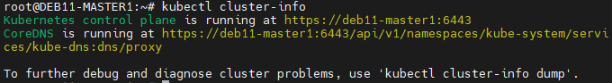
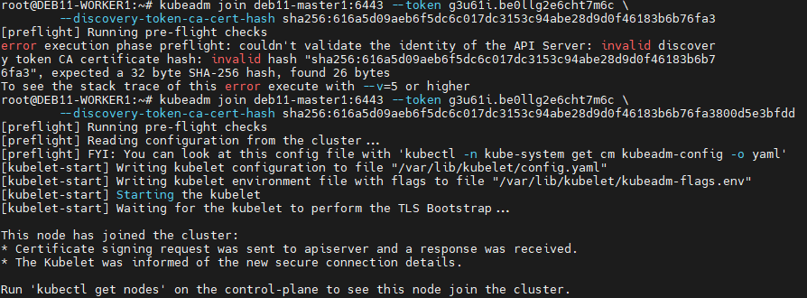

# Installation d'un cluster avec kubeadm
## Prés requis
- Compatible linux distribution
- \> 2Go RAM
- \> 2CPU
- Unique hostname and mac address and product uid
- Network port open beetwen host
- swap disable

## Install
### NTP
```bash
apt-get update
apt-get install ntp
```
### Docker 
Ajouts des repot
```bash
sudo apt-get update
sudo apt-get install ca-certificates curl gnupg
sudo install -m 0755 -d /etc/apt/keyrings
curl -fsSL https://download.docker.com/linux/debian/gpg | sudo gpg --dearmor -o /etc/apt/keyrings/docker.gpg
sudo chmod a+r /etc/apt/keyrings/docker.gpg
echo \
  "deb [arch="$(dpkg --print-architecture)" signed-by=/etc/apt/keyrings/docker.gpg] https://download.docker.com/linux/debian \
  "$(. /etc/os-release && echo "$VERSION_CODENAME")" stable" | \
  sudo tee /etc/apt/sources.list.d/docker.list > /dev/null
```

Installtion
```bash
sudo apt-get update
sudo apt-get install containerd.io
```

### Kubelet, kebeadm (Tous les noeuds)
```bash
curl -fsSL https://packages.cloud.google.com/apt/doc/apt-key.gpg | sudo gpg --dearmor -o /etc/apt/keyrings/kubernetes-archive-keyring.gpg

echo "deb [signed-by=/etc/apt/keyrings/kubernetes-archive-keyring.gpg] https://apt.kubernetes.io/ kubernetes-xenial main" | sudo tee /etc/apt/sources.list.d/kubernetes.list

sudo apt-get update
sudo apt-get install -y kubelet kubeadm
sudo apt-mark hold kubelet kubeadm
```

### Kubectl
```bash
sudo apt-get install -y kubectl
sudo apt-mark hold kubectl
```

### Transférer les IPv4
```bash
cat <<EOF | sudo tee /etc/modules-load.d/k8s.conf
overlay
br_netfilter
EOF

sudo modprobe overlay
sudo modprobe br_netfilter

# sysctl params required by setup, params persist across reboots
cat <<EOF | sudo tee /etc/sysctl.d/k8s.conf
net.bridge.bridge-nf-call-iptables  = 1
net.bridge.bridge-nf-call-ip6tables = 1
net.ipv4.ip_forward                 = 1
EOF

# Apply sysctl params without reboot
sudo sysctl --system
```



sudo systemctl restart containerd
sudo systemctl enable containerd

### Initialisation control plane (DEB11-MASTER1)
kubeadm init --control-plane-endpoint=deb11-master1 // tous doit être en minuscule

To start interacting with cluster, run following commands on master node,
```bash
mkdir -p $HOME/.kube
sudo cp -i /etc/kubernetes/admin.conf $HOME/.kube/config
sudo chown $(id -u):$(id -g) $HOME/.kube/config
```

Run following kubectl command to get nodes and cluster information,
```bash
kubectl get nodes
kubectl cluster-info
```



### Join worker 
```bash
kubeadm join deb11-master1:6443 --token g3u61i.be0llg2e6cht7m6c \
        --discovery-token-ca-cert-hash sha256:616a5d09aeb6f5dc6c017dc3153c94abe28d9d0f46183b6b76fa3800d5e3bfdd
```


### Installer la pile réseau
```bash
kubectl apply -f https://raw.githubusercontent.com/projectcalico/calico/v3.25.0/manifests/calico.yaml
```
### Trooblshoot
Erreur dans le DNS au moment de la jonction
```bash
[kubelet-check] Initial timeout of 40s passed.

Unfortunately, an error has occurred:
        timed out waiting for the condition

This error is likely caused by:
        - The kubelet is not running
        - The kubelet is unhealthy due to a misconfiguration of the node in some way (required cgroups disabled)

If you are on a systemd-powered system, you can try to troubleshoot the error with the following commands:
        - 'systemctl status kubelet'
        - 'journalctl -xeu kubelet'

Additionally, a control plane component may have crashed or exited when started by the container runtime.
To troubleshoot, list all containers using your preferred container runtimes CLI.
Here is one example how you may list all running Kubernetes containers by using crictl:
        - 'crictl --runtime-endpoint unix:///var/run/containerd/containerd.sock ps -a | grep kube | grep -v pause'
        Once you have found the failing container, you can inspect its logs with:
        - 'crictl --runtime-endpoint unix:///var/run/containerd/containerd.sock logs CONTAINERID'
error execution phase wait-control-plane: couldn't initialize a Kubernetes cluster
To see the stack trace of this error execute with --v=5 or higher
root@DEB11-MASTER1:~# systemctl status kubelet

```

kubectl describe node node01


## Source
https://kubernetes.io/docs/setup/production-environment/tools/kubeadm/install-kubeadm/
https://docs.docker.com/engine/install/debian/
https://www.it-connect.fr/configurer-un-client-ntp-sous-linux/
https://www.linuxtechi.com/install-kubernetes-cluster-on-debian/