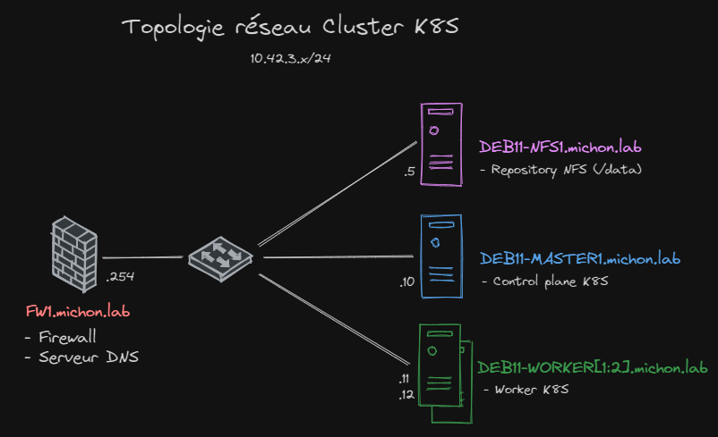
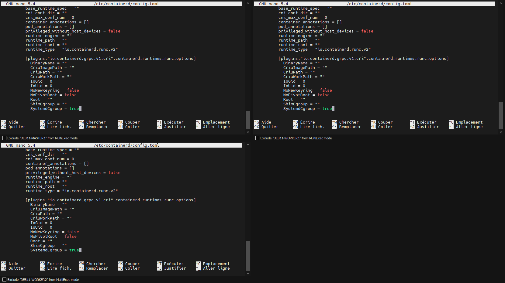
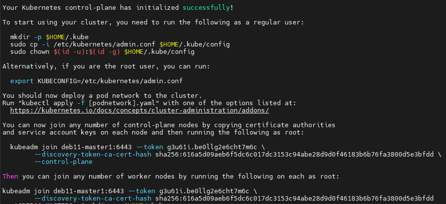
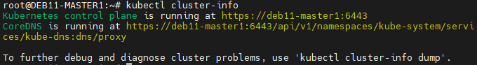

# Installation d'un cluster avec kubeadm
## Topologie retenue

## Prés requis

- Compatible linux distribution
- \> 2Go RAM
- \> 2CPU
- Unique hostname and mac address and product uid
- Network port open beetwen host
- swap disable

## Install

### NTP
Pour que l'ensemble de nos noeuds soit à la même heure.

```bash
apt-get update
apt-get install ntp
```

### ContainerD

Pour l'éxécution de nos container, étant donné que le support de docker et déprécier a partir de la version 2.10 de kubernetes.
#### Ajout du repository

```bash
sudo apt-get update
sudo apt-get install ca-certificates curl gnupg
sudo install -m 0755 -d /etc/apt/keyrings
curl -fsSL https://download.docker.com/linux/debian/gpg | sudo gpg --dearmor -o /etc/apt/keyrings/docker.gpg
sudo chmod a+r /etc/apt/keyrings/docker.gpg
echo \
  "deb [arch="$(dpkg --print-architecture)" signed-by=/etc/apt/keyrings/docker.gpg] https://download.docker.com/linux/debian \
  "$(. /etc/os-release && echo "$VERSION_CODENAME")" stable" | \
  sudo tee /etc/apt/sources.list.d/docker.list > /dev/null
```

#### Installtion

```bash
sudo apt-get update
sudo apt-get install containerd.io
```

## Ajout d'un dépots NFS
### Serveur NFS
On installer le serveur NFS
`apt install nfs-kernel-server`
Crée le répertoire à partagé
`mkdir /data`
Application de droit système réduit sur le répértoire
`chown nobody:nogroup /data/`
Edition du fichier /etc/export, pour y ajouter les addresses de nos noeuds
New line with :
```bash
/data 10.42.3.10(rw,sync,no_subtree_check) 10.42.3.11(rw,sync,no_subtree_check) 10.42.3.12(rw,sync,no_subtree_check)
```

### Kubernetes
#### Kubelet, kebeadm (Tous les noeuds)

```bash
curl -fsSL https://packages.cloud.google.com/apt/doc/apt-key.gpg | sudo gpg --dearmor -o /etc/apt/keyrings/kubernetes-archive-keyring.gpg

echo "deb [signed-by=/etc/apt/keyrings/kubernetes-archive-keyring.gpg] https://apt.kubernetes.io/ kubernetes-xenial main" | sudo tee /etc/apt/sources.list.d/kubernetes.list

sudo apt-get update
sudo apt-get install -y kubelet kubeadm
sudo apt-mark hold kubelet kubeadm
```

#### Kubectl (Controle plane)

```bash
sudo apt-get install -y kubectl
sudo apt-mark hold kubectl
```

#### Transférer les IPv4 (Tous les noeuds)

```bash
cat <<EOF | sudo tee /etc/modules-load.d/k8s.conf
overlay
br_netfilter
EOF

sudo modprobe overlay
sudo modprobe br_netfilter

# sysctl params required by setup, params persist across reboots
cat <<EOF | sudo tee /etc/sysctl.d/k8s.conf
net.bridge.bridge-nf-call-iptables  = 1
net.bridge.bridge-nf-call-ip6tables = 1
net.ipv4.ip_forward                 = 1
EOF

# Apply sysctl params without reboot
sudo sysctl --system
```

#### Cgroups


sudo systemctl restart containerd
sudo systemctl enable containerd

### Initialisation control plane (DEB11-MASTER1)

```bash
kubeadm init --control-plane-endpoint=deb11-master1 // tous doit être en minuscule
```
Résultat attendue :

To start interacting with cluster, run following commands on master node,

```bash
mkdir -p $HOME/.kube
sudo cp -i /etc/kubernetes/admin.conf $HOME/.kube/config
sudo chown $(id -u):$(id -g) $HOME/.kube/config
```

Run following kubectl command to get nodes and cluster information,

```bash
kubectl get nodes
kubectl cluster-info
```




#### Join worker

```bash
kubeadm join deb11-master1:6443 --token g3u61i.be0llg2e6cht7m6c \
        --discovery-token-ca-cert-hash sha256:616a5d09aeb6f5dc6c017dc3153c94abe28d9d0f46183b6b76fa3800d5e3bfdd
```

#### Installer la pile réseau

```bash
kubectl apply -f https://raw.githubusercontent.com/projectcalico/calico/v3.25.0/manifests/calico.yaml
```

### Helm (Poste de gestion)
Install
```bash
curl -fsSL -o get_helm.sh https://raw.githubusercontent.com/helm/helm/main/scripts/get-helm-3
chmod 700 get_helm.sh
./get_helm.sh
```

#### Package NFS
```helm
# Add Repo
helm repo add nfs-subdir-external-provisioner https://kubernetes-sigs.github.io/nfs-subdir-external-provisioner/

# Add Deployment
helm install nfs-subdir-external-provisioner nfs-subdir-external-provisioner/nfs-subdir-external-provisioner \
    --set nfs.server=deb11-nfs1.michon.lab \
    --set nfs.path=/data \
    --set nfs.mountOptions=nfsvers=4.1

```

#### Lister les paquets
helm list

#### Désinstaller
helm uninstall \<app\>

### Sécurité
#### Network Policy 
Pour nos Network Policy, nous suivrons les recommandation suivante :
Point clé :
-   Utilisez la politique réseau "default deny-all" pour garantir que seules les communications explicitement autorisées se produisent.
- Regroupez les Pods qui doivent communiquer entre eux en utilisant le paramètre PodSelector.
- Autorisez la communication entre les espaces de noms (namespaces) uniquement lorsque c'est nécessaire.
- N'autorisez pas les communications réseau inutiles, même au sein du cluster Kubernetes.
- Faites preuve de prudence lors de l'autorisation de Pods à l'intérieur du cluster pour recevoir du trafic réseau provenant de l'extérieur du cluster.
- Le fait de refuser le trafic sortant vers Internet public peut interférer avec des mises à jour spécifiques de l'application ou des processus de validation.

Serc : https://snyk.io/blog/kubernetes-network-policy-best-practices/

### Deployment
Cloné le dépot github sur votre machine, avec kubelet :
`git clone https://github.com/Davidstos/devops-ipi.git`

Appliqué la configuration :
`kubectl apply -f .\manifest\app\`

### Commande 
Quelques commandes qui nous ont bien aider :
Listé tous les pods : `kubectl get pods -A`
Listé toutes les ressource : `kubectl get all -A`
Voir l'êtat d'un pod : `kubectl describe pod app1-mariadb-5f9cd66579-zzfnm -n app1`

Vérifier les montage en cours NFS : `watch -n 1 'netstat -ant | grep ":2049"'`

Entrée dans le CT : `kubectl exec -it app1-mariadb-5f9cd66579-zzfnm -n app1 -- /bin/bash`

CLI Mariadb : `mariadb -h 127.0.0.1 -P 3306 -u root -proot`

## Source

- https://kubernetes.io/docs/setup/production-environment/tools/kubeadm/install-kubeadm/
- https://docs.docker.com/engine/install/debian/
- https://www.it-connect.fr/configurer-un-client-ntp-sous-linux/
- https://www.linuxtechi.com/install-kubernetes-cluster-on-debian/
- https://www.digitalocean.com/community/tutorials/how-to-set-up-an-nfs-mount-on-debian-11
